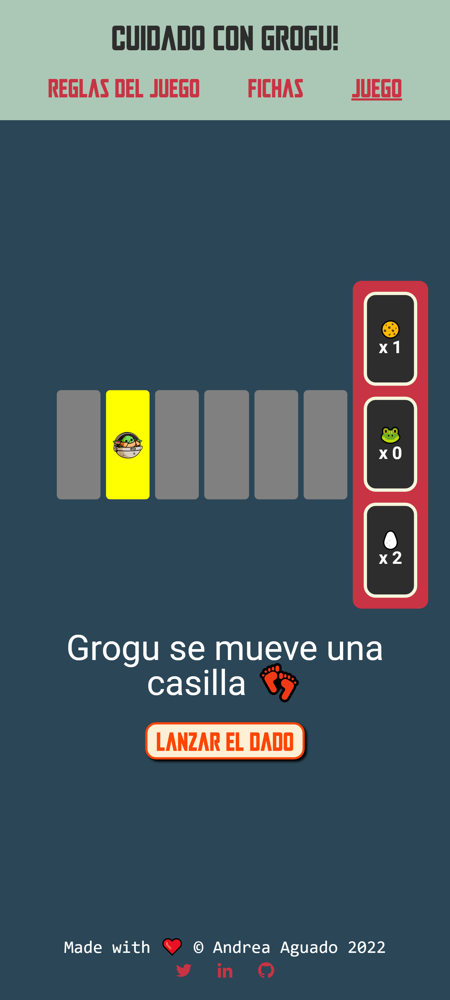

# Cuidado con Grogu (Beware of Grogu)

This project was created for a technical test. It consists of a _The Mandalorian_ inspired game in which the user has a mission to accomplish by unloading a ship before Grogu has had the chance to eat the merchandising.

To see the final result please visit [my github pages](https://andreaaguado.github.io/Cuidado-con-Grogu/) 🤗

## Page

| Start a game                                                                                                                    | Game                                                                                                                 | Game                                                                                                                 | Final Screen                                                                                                                       |
| ------------------------------------------------------------------------------------------------------------------------------- | -------------------------------------------------------------------------------------------------------------------- | -------------------------------------------------------------------------------------------------------------------- | ---------------------------------------------------------------------------------------------------------------------------------- |
|             |  |  |                |
| Under the /game path the user is redirected to this page. To start playing they have to click the button located in the center. | Once the user has clicked the button they'll start a new game. They game has been modeled responsively.              | To play they just have to click the dice button until either they or Grogu win.                                      | The user will be notified of the result in the final screen where they can choose to play again clicking the button at the bottom. |

### This repository is conformed by:

- The files that are loose in the repository root, such as _package.json_ are used in the configuration of the project.
- The `src/` folder: are the files of the web page such as **HTML, SCSS, and the React Components and Services...**
- The `public/` and `docs/` folders.

## Quick Start Guide

> **NOTE:** You need to have [Node JS](https://nodejs.org/) installed to work with this page:

### Steps to follow to use this project in your own computer:

### Install the local dependencies by running in the terminal the command:

```bash
npm install
```

### To start the project run the command:

```bash
npm start
```

This project was bootstrapped with [Create React App](https://github.com/facebook/create-react-app).
